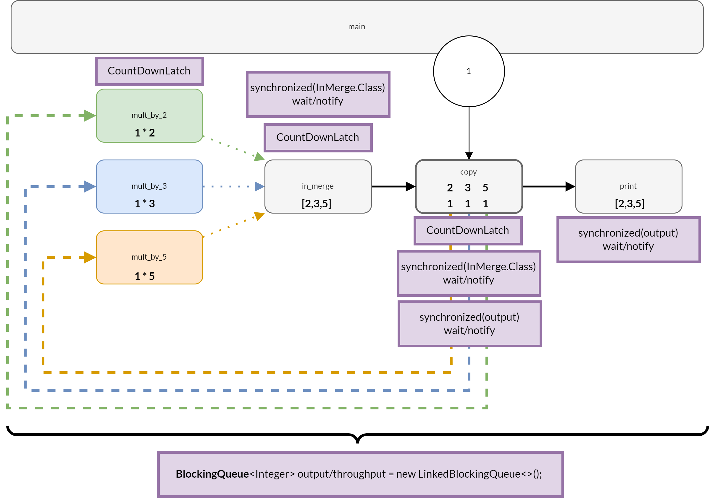
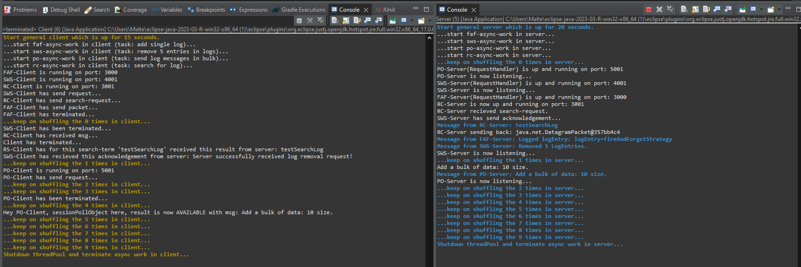
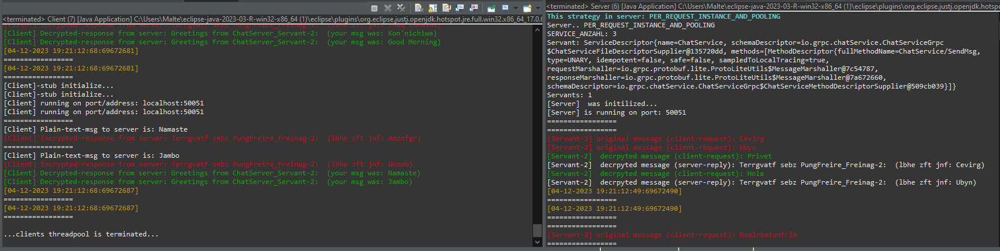

# Distributed Systems Engineering (essentials)

- a former university project (Distributed Systems Engineering of the University of Vienna, winter semester 2023)

This project covers essential distributed systems engineering topics such as concurrency, 

or socket programming, 

and other topics like remote objects

, remoting patterns, RPC, remoting lifecycle management, 

REST or messaging.
